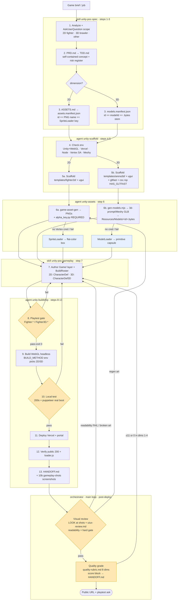

# unity-poc — overview

Worker-less pipeline: a game brief → design docs → asset analysis → real assets (**2D**
sprites via Vertex AI nano-banana, **3D** models via Meshy/glTFast) → code-driven Unity
project → headless playtest → WebGL build → local browser test → public Vercel URL.
Everything spawns from C# at runtime (one empty boot scene, no hand-authored scenes or
prefabs) so the whole pipeline runs headless. Ships **two** full fighter frameworks — a 2D
fighter (`templates/fighter2d/`) and a 3D arena brawler (`templates/arena3d/`).

> **`SKILL.md` is the contract** — a thin orchestrator. The 13-step build pipeline is split
> into **five phases** (two run **in the main loop as skills**, three as **isolated agents**
> the orchestrator spawns via the Task tool), then **two orchestrator post-phases** run back in
> the main loop after deploy. In order:
> skill `unity-poc-spec` (1–3, PRD/TDD/manifest) → agent `unity-scaffold` (4–5, env + create) →
> agent `unity-assets` (6, gen art) → skill `unity-poc-gameplay` (7, author `Game/`) →
> agent `unity-buildship` (8–13, playtest/build/deploy/handoff + gameplay screenshots) →
> **orchestrator visual review** (LOOK at the shots + `references/uiux-review.md` checklist,
> readability = hard gate) → **orchestrator quality grade** (`references/quality-rubric.md`,
> score block onto `HANDOFF.md`). Split rule: interactive / code-authoring stay skills;
> non-interactive execution with noisy logs become agents; the two review passes need your eyes
> so they stay in the main loop. Shared assets (`templates/*/`, `scripts/`, `references/`) stay
> in **this** dir; skills reference them by `../unity-poc/…`, agents (in `.claude/agents/`) by
> `.claude/skills/unity-poc/…`. Full gotchas: `references/gotchas.md`. When docs disagree, the
> phase file wins; fix this one.

## Flow chart

Root `unity-poc` is a thin orchestrator; each dashed box is one phase — a **skill** loaded in
the main loop (spec, gameplay, the two review passes) or an **agent** spawned via the Task tool
(scaffold, assets, buildship). Steps numbered as in the pipeline.

Five build phases (2 skills + 3 agents) then two orchestrator post-phases (visual review,
quality grade) back in the main loop; shared assets (`templates/*/`, `scripts/`, `references/`)
stay in the root dir. Both dimensions converge after asset gen onto the same gates.
**Four hard gates** now guard the ship: **playtest** (aborts the build) and **local browser
test** (aborts the deploy) inside `unity-buildship`, then **visual review** (any readability
FAIL blocks the ship) and **quality grade** (≤11 or a 0 in dims 1–4 = not shippable) run by the
orchestrator on the returned screenshots. The buildship agent returns the failure (or the shots)
and the orchestrator drops back to `unity-poc-gameplay` to fix — or to `unity-assets` to regen
art — then re-spawns. Asset gen is **never** a gate — missing/failed art degrades to a
flat-color box (2D) or a primitive capsule (3D), blue paths; build still ships.

## Scope honesty — bundled vs build-from-scratch

The **pipeline** (scaffold → asset gen → headless WebGL build → browser test → Vercel) is
**genre-agnostic**. **Two** bundled fighter frameworks ship — pick by brief; both are full
fighters with a headless `Playtest*` gate that reflects on `BuildRoster()`.

| brief | template | namespace | assets | playtest | invocation |
|-------|----------|-----------|--------|----------|------------|
| **2D fighter / arcade** | `templates/fighter2d/` | `Fighter` | 2D PNG sprites (`game-asset-gen`) | reuse fighter gate | `scripts/*.sh` (default `Fighter.*`) |
| **3D arena brawler** | `templates/arena3d/` | `Fighter3D` | Meshy GLB models (`gen-models.mjs` → glTFast, primitive fallback) | reuse `Playtest3D` gate | `scripts/*.sh` + `BUILD_METHOD`/`PLAYTEST_METHOD=Fighter3D.*` env |
| **platformer / cozy / other** | — | your own | write from scratch | **rewrite** `Playtest` assertions | direct Unity CLI with your namespace's `BuildWebGL` / `Playtest.Run` |

The 3D framework moves on the XZ plane with **sphere-based** hit/hurt volumes (rotation-free,
robust) and loads real `.glb` models with a primitive-capsule fallback. Validated end-to-end:
compiles → 6/6 playtest matchups → WebGL build → clean browser boot. See
`references/fighter-framework.md` (2D) and `references/3d-framework.md` (3D). Don't promise
"reuse the framework" for a non-fighter game.

## Pipeline (five build phases + two orchestrator post-phases — 3 skills + 3 agents)

> skill **`unity-poc-spec`** (1–3) · agent **`unity-scaffold`** (4–5) · agent
> **`unity-assets`** (6) · skill **`unity-poc-gameplay`** (7) · agent **`unity-buildship`**
> (8–13, + step 10b gameplay screenshots) · then the orchestrator runs **visual review** and
> **quality grade** in the main loop on the returned shots. Skill detail lives in each phase
> `SKILL.md`; agent detail in `.claude/agents/<name>.md`.

1. **Analyze the brief** — genre, core loop, systems, roster, stages, controls, win
   condition. Confirm scope with `AskUserQuestion`. Generic briefs ("cozy mobile game")
   need a concrete game *invented* and confirmed here.
2. **`PRD.md` → `TDD.md`** — design first. PRD = self-contained game concept (named game,
   numbers, content spec). TDD = harness-constraints table, per-system design, risk
   register pre-empting every gotcha below.
3. **`ASSETS.md` → `assets.manifest.json`** — enumerate every 2D visual; manifest `id` ==
   PNG filename == `SpriteLoader` lookup key (one namespace). Schema lives in the
   **`game-asset-gen`** skill (`references/manifest-schema.md`).
4. **Check environment** — Unity `6000.x` + **WebGL** module, Vercel CLI + Node 18+, a
   Vertex SA for asset gen (optional — missing just falls back to flat-color art).
5. **Scaffold** — fighter: headless `-createProject`, copy `Scripts/` + `Editor/`, add
   `com.unity.ugui`. Non-fighter: copy a proven cozy scaffold, rename namespace, rewrite the
   game layer.
6. **Generate assets** — **`game-asset-gen`** turns the manifest into PNGs in
   `Assets/Resources/Art/<id>.png`, then **`alpha_key.py` (REQUIRED for `transparent`
   sprites)** strips nano-banana's fake-checkerboard background to real alpha. Idempotent;
   never a hard gate.
7. **Author the game** — the `Game/` layer; boot `GameBootstrap` via
   `[RuntimeInitializeOnLoadMethod]`, wire art through `SpriteLoader.Get("<id>")`. Fighter:
   expose `BuildRoster()` and reuse `Framework/`. Non-fighter: write systems + a matching
   `Playtest`.
8. **Playtest (REQUIRED, gate)** — headless, deterministic, no scene. Fighter:
   `scripts/playtest.sh`. Non-fighter: your `Playtest.Run` asserting model + boot graph.
   Aborts the build on failure.
9. **Build WebGL** — headless; compression **Disabled** → serves from any static host.
10. **Local test (REQUIRED, gate)** — `scripts/local-test.sh <out>` serves the build,
    asserts `index/loader/wasm/data` all 200, then boots it in real Chrome via puppeteer to
    catch boot-time faults (stripped classes, dead UI) a curl/single screenshot misses.
    **10b. Gameplay screenshots** — when the project ships a `gameplay-shots` config,
    `scripts/gameplay-shots.mjs` drives the live build and captures shots (returned to the
    orchestrator for step 14, and diffed vs `_baseline/` for regression).
11. **Deploy** — `scripts/deploy-vercel.sh <out> <lowercase-name>` (runs local test, aborts
    on fail; one-time `npx vercel login`/`link`). Prints `https://…vercel.app`.
12. **Verify public** — curl the live URL (200, not a login wall); confirm `*.loader.js`
    reachable.
13. **`HANDOFF.md`** — systems, controls, known limits, next steps, and which assets are
    real vs flat-color fallback.

**Orchestrator post-phases (main loop — need your eyes, so not agents):**

14. **Visual review (REQUIRED, gate)** — Read the step-10b screenshots and LOOK: broken alpha
    (checker boxes), invisible/default-font UI, floating or mis-scaled sprites, dead scenes.
    The boot test proves it *runs*; only this catches it looking *wrong*. Then run the UI/UX
    checklist (`references/uiux-review.md`): readability (contrast, state visibility, text
    floor), hierarchy, feedback, style coherence, + baseline regression vs `_baseline/`. **Any
    readability FAIL blocks the ship** — loop back to `unity-poc-gameplay` (code/presentation)
    or `unity-assets` (regen art).
15. **Quality grade** — score the shipped slice against `references/quality-rubric.md` (8
    dimensions, 0–3, evidence per line); append the score block to `HANDOFF.md`, name the
    biggest gap + next lever. **≤11 or any 0 in dims 1–4 = not shippable**, loop back. Then hand
    the URL to the user with a playtest ask (fun? clear? fair? the ONE change?) to seed the next
    iteration.

## Framework (reused per *fighter* job — `templates/fighter2d/Assets/Scripts/Framework/`)

- **`GameBootstrap.cs`** — single scene object; builds camera/stage/HUD, runs
  `Select → RoundIntro → Fight → RoundEnd → MatchEnd` at fixed 60fps in `FixedUpdate`.
- **`Fighter.cs`** — kinematic fighter (no Rigidbody): state machine, frame-data attack
  timeline, health/meter, install + stance-swap, world-space hit/hurt boxes.
- **`CombatSystem.cs`** — per-frame hitbox↔hurtbox resolution; damage/stun/knockback/meter,
  hitstop, hit sparks.
- **`MoveData.cs` / `CharacterDef.cs`** — pure data (frame data + character knobs). Edit per brief.
- **`InputReader.cs`** — legacy `UnityEngine.Input` (WebGL-safe; build sets `activeInputHandler = Both`).
- **`HudController.cs` / `SelectMenu.cs`** — uGUI built entirely in code (no prefabs).
- **`CameraRig.cs` / `PrimitiveArt.cs`** — auto-framing ortho camera; runtime flat-color sprites.
- **`SpriteLoader.cs`** — loads `Assets/Resources/Art/<id>.png` at runtime (WebGL-safe,
  synchronous), caches, falls back to `PrimitiveArt` for any missing id.
- **`StoryOverlay.cs`** — intro/clash/closing story text.
- **`Playtest.cs`** — headless deterministic match sim (no scene), asserts combat plays.
- **`Editor/BuildScript.cs`** — `BuildWebGL` + `RunPlaytest`. **Game-agnostic** — finds the
  roster by reflecting on `BuildRoster()`, never by game-class name.

> A **non-fighter** game reuses only the *patterns* here (code-driven boot, world-space
> sprite HUD to dodge uGUI stripping, a zero-dep tween/particle juice layer, `SpriteLoader`
> + fallback). It does **not** reuse `Fighter`/`CombatSystem`/the fighter `Playtest`.

## 3D framework (reused per *brawler* job — `templates/arena3d/Assets/Scripts/Framework3D/`)

Namespace `Fighter3D`, full parity with the 2D fighter — same files one dimension up
(`GameBootstrap3D`, `Fighter3D`, `CombatSystem3D`, `MoveData3D`/`CharacterDef3D`,
`InputReader3D`, `HudController3D`/`SelectMenu3D`/`StoryOverlay3D`, `CameraRig3D`, `Playtest3D`,
`Editor/BuildScript3D.cs`). Deltas:

- **Movement on the XZ plane** — facing-relative `moveFwd`/`moveStrafe`, gravity on Y, auto-faces
  the opponent, clamped to a circular arena.
- **Sphere combat** — hit/hurt volumes are spheres (`reach`/`height`/`radius`), so resolution is
  rotation-free and robust to author blind. No oriented-box edge cases.
- **`ModelLoader.cs`** — loads `Assets/Resources/Models/<modelId>.bytes` via **glTFast**, parents
  it under the fighter; any failure keeps the primitive capsule. All glTFast calls sit behind
  `#if HAS_GLTFAST`, so the package is optional and a missing dep never breaks the build.
- **`PrimitiveArt3D.cs`** — runtime `CreatePrimitive` capsule/cube/sphere, tinted via
  `MaterialPropertyBlock`. `GameBootstrap3D` adds a directional key light + flat ambient (a 3D
  scene with no light renders black). `BuildScript3D` forces `Standard` into Always-Included
  Shaders so runtime `Shader.Find` survives stripping.
- Models come from `models.manifest.json` → `game-asset-gen/gen-models.mjs` → the `3d-prompt`
  skill (Meshy GLB). `modelId` == manifest `id` == `<id>.bytes` stem.

## Gotchas (full list in `references/gotchas.md`; each phase repeats its own)

- **IL2CPP stripping kills runtime-created components** → "Could not produce class with ID N"
  at boot. Build uses `ManagedStrippingLevel.Minimal` + `stripEngineCode = false`. Boot-time
  fault — only the puppeteer browser test catches it.
- **nano-banana never returns real alpha** — "transparent background" comes back as opaque
  RGB with a painted checkerboard. **Run `alpha_key.py`** or sprites show grey boxes.
- **`ref` over-reaches on inanimate props** — referencing a character-rich concept board when
  generating a plain object injects that character. Drop `ref` + add hard negatives.
- **No EventSystem = dead UI** (uGUI path). World-space sprite HUDs sidestep it entirely.
- **WebGL compression Disabled** on purpose (plain static hosting).
- **Generated art must live under `Assets/Resources/Art/`** (2D) or `Assets/Resources/Models/<id>.bytes`
  (3D) — only `Resources/` ships for `Resources.Load`, and a raw `.glb` won't load (needs the
  `.bytes` `TextAsset` extension).
- **(3D) glTFast is optional, gated by `HAS_GLTFAST`** — real models need BOTH
  `com.unity.cloud.gltfast` AND `Assets/csc.rsp` with `-define:HAS_GLTFAST`; add the define ONLY
  when the package is present, or skip both for a primitive-only build that still ships.
- **`*.sh` scripts default to `Fighter.*`** — 3D builds set `BUILD_METHOD`/`PLAYTEST_METHOD=Fighter3D.*`;
  non-fighter builds invoke Unity directly with their own namespace. `local-test.sh` +
  `deploy-vercel.sh` are namespace-agnostic.

## Built examples

| project | genre | notes |
|---------|-------|-------|
| `blood-bloom-protocol/` | 2D fighter | reuses `Framework/` verbatim; only the `Game/` roster file is job-specific |
| `templates/arena3d/` (ArenaClash3D) | 3D arena brawler | bundled example; 3 fighters (rushdown/stance/zoning). Validated: compiles → 6/6 playtest → WebGL build → clean browser boot |
| `tiny-pet/` | cozy virtual pet | non-fighter; own scripts + juice harness, no fighter framework |
| `stack-and-bake/` | cozy cooking | non-fighter; **full new asset-gen path** — real nano-banana sprites + `alpha_key.py`, `SpriteLoader` + `Art` fallback. Live: `stack-and-bake.vercel.app` |

## Best fit

Single-scene, mechanics-first prototypes. **2D fighter** and **3D arena brawler** briefs are
the fast path (reuse `templates/fighter2d/` or `templates/arena3d/` verbatim, write only the `Game/` roster).
Platformer / arcade / cozy briefs use the pipeline + the cozy scaffold pattern and write their
own gameplay + playtest.
